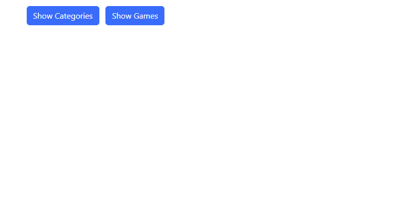
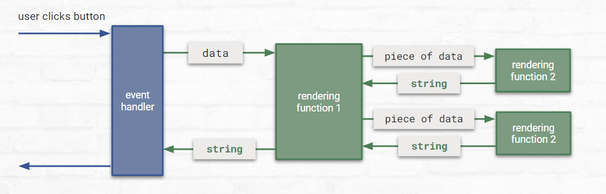

# Project 3: UIs and APIs

## Description

Create an app that pulls data from an API in two different ways and displays the data in the page.

## Week 7

For this project we're going to combine user input and getting data from an API to make a little app. Here's the flow we're going to build.

1. User input
2. Ask API for array of data
3. Render array of data
4. User picks an item in array
5. Ask API for data related to item
6. Render data related to item

In this week you'll write the rendering code. Next week we'll hook it up to an API.

At the end of this week, your app may work something like this:



## Task 1: Pick An API

While you won't be using the API until next week, you'll need to pick one so you can start writing the UI code.

Here are the three options. If you'd like to use a different API than these three, you'll need to get it approved by a mentor.

Once you've picked an API, look around a bit in the documentation. Don't worry if it looks scary, we'll learn how to read API documentation next week.

#### [Merriam-Webster Dictionary API]()

Merriam-Webster has 3 main APIs:

* [Collegiate Dictionary](https://dictionaryapi.com/products/api-collegiate-dictionary) - gets a list of definitions of a word (for example: definitions of the word "skip")
* [Collegiate Thesaurus](https://dictionaryapi.com/products/api-collegiate-thesaurus) - gets a list of synonyms of a word (for example: synonyms of the word "organization")
* [Spanish-English Dictionary](https://dictionaryapi.com/products/api-spanish-dictionary) - gets the English translation of a Spanish word, or the Spanish translation of an English word (for example: "wild, savage, feral" from "salvaje" or "salvaje, silvestre, agreste" from "wild")

For this API you could do a flow like this:

User types in a word -> Ask Collegiate Thesaurus for synonyms of the word and render each with a Get Definition button -> User picks a word to get definition for -> Ask Collegiate Dictionary for definitions of word and render them

Or this:

User types in a Spanish word -> Ask Spanish-English Dictionary for English translations of the word and render each with a Get Definition or Get Synonyms button -> User picks a word -> Ask Collegiate Dictionary for definitions or Collegiate Thesaurus for synonyms and render them

#### [Open Weather API](https://openweathermap.org/api)

OpenWeather has four free APIs:

* [Geocoding](https://openweathermap.org/api/geocoding-api) - from the name of a location (city or area) gets an array of location match objects with latitudes and longitudes (for example: locations that match the name "London")
* [Current Weather](https://openweathermap.org/current) - from latitude and longitude get weather data (for example: the current weather for 51 N 0 W)
* [Air Pollution](https://openweathermap.org/api/air-pollution) - from latitude and longitude gets current air pollution, or forecasted air pollution, or historical air pollution (for example: forecasted air pollution for 51 N 0 W)
* [5 Day Weather](https://openweathermap.org/forecast5) - from latitude and longitude gets forecasted weather for 5 days (for example: 5 day forecast for 51 N 0 W)

For this API you could do a flow like this:

User types in location name -> Ask Geocoding API for location matches and render each with a View button -> User picks a location to view -> Ask Current Weather or Air Pollution or 5 Day Weather API for weather/pollution data about the location and render it

#### [New York Times API](https://developer.nytimes.com/apis)

The New York Times has six free APIS:

* [Archive](https://developer.nytimes.com/docs/archive-product/1/overview) - gets articles for a particular month/year (for example: all articles from May 2019)
* [Article Search](https://developer.nytimes.com/docs/articlesearch-product/1/overview) - gets articles that match a particular search string with optional filtering, pagination, and data ranking (for example: articles that match the search term "stock market" that were published on Mondays)
* [Books API](https://developer.nytimes.com/docs/books-product/1/overview) - gets best seller list names (for example: a list with Hardcover Nonfiction, Hardcover Fiction, Paperback Nonfiction, etc), or books on a particular best seller list (for example: books on the Paperback Nonfiction best seller list), or book reviews for a particular author, isbn, or title (for example: reviews for Stephen King books)
* [Most Popular API](https://developer.nytimes.com/docs/most-popular-product/1/overview) - gets the most popular viewed articles, or the most popular shared articles, or the most popular emailed articles over the past particular number of days (for example: the most shared articles in the past 4 days)
* [Times Wire API](https://developer.nytimes.com/docs/timeswire-product/1/overview) - gets a list of sections, or up-to-the-minute most recent articles from a particular source and section (for example: most recent articles from the NYT in the World section)
* [Top Stories API](https://developer.nytimes.com/docs/top-stories-product/1/overview) - gets the top articles in a particular section (for example: the top articles in the Business section)

With this API you have a lot of options. You could do a flow like this:

User clicks a button -> Ask Times Wire for a list of sections and render each with a View Articles button -> User picks a section -> Ask Times Wire for recent articles published in that section and render them

Or this:

User types in a search -> Ask Article Search for articles matches, and render each with a month/year link -> User clicks on a month/year link -> Ask Archive API for all articles for that month/year and render them

Or this:

User picks a best seller list -> Ask Books API for books on that best seller list and render each with a View Reviews button -> User picks a book on the list -> Ask Books API for reviews for that book and render them

### Task 2: Test Data

This week we're going to build code that renders data from an array when the user clicks a button. So pick what data you want to display at the end of your flow. Maybe it's books and book reviews or maybe its NYT articles or maybe it's locations and a weather forecast.

Make some test data we can use until we get the real data from the API. Think about what you think you'll want to display and put properties on each test object. Don't try to make the structure and property names match the API, we'll be manipulating the data we get from the API to match what we're expecting. **And don't try to do this part perfectly** (I'm looking at you 🫵) Building software is about trial and error and u-turns and revising! Embrace the imperfection right now. We'll polish it up later.

For example, if my flow was this:

User clicks a button -> Ask Board Game API for all game categories and render each with View Games button -> User picks game category -> Ask Board Game API for all games in the category and render

Then I might make this test data:

```javascript
const TEST_CATEGORIES = [
    {
        id: 0,
        name: "Strategy",
    },
    {
        id: 1,
        name: "Family"
    },
    {
        id: 2,
        name: "Dice"
    },
    {
        id: 2,
        name: "Party"
    }
]

const TEST_GAMES = [
    {
        id: 0,
        name: "Scythe",
        rating: 4.8,
        numPlayers: "2-5"
    },
    {
        id: 1,
        name: "Marvel United",
        rating: 4.1,
        numPlayers: "2-4"
    },
    {
        id: 1,
        name: "Agricola",
        rating: 4.2,
        numPlayers: "1-4"
    }
]
```

Because I'm hoping to display the name of each category and the name, rating, and number of players for each board game.

### Task 3: Render the Data

To render the data, we'll need to build the HTML using the DOM. There are many ways to do this, but the way we'll use is to write rendering functions that work together to build a large string of HTML, and we'll put that string in an inner HTML property. This will allow us to practice writing functions that call each other, pass parameters, and return values. It's also a common way to handle rendering.

**Write at least 3 rendering functions** that each handle rendering one chunk of the page and work together to render the page.

**Create two buttons and an event handler function for clicking each button** Set it up so that when each button is clicked it renders one set of test data in the page using the innerHTML property. Don't worry about making these buttons nice, we'll rework them in Week 9.

For my board game example, I might make these 6 functions:

```javascript
function onShowCategoriesClick() {
    // calls renderCategoryList with the array of TEST_CATEGORIES
    // and puts the string that's returned in the innerHTML property of an element on the page
}

function onShowGamesClick() {
    // calls renderGamesList with the array of TEST_GAMES 
    // and puts the string that's returned in the innerHTML property of an element on the page
}

function renderCategoryList(categoryList) {
    // returns a string of the HTML for the whole category list
    // (uses the renderCategory function to get the HTML string for each category)
}

function renderCategory(category) {
    // returns a string of the HTML for one category list item
}

function renderGameList(gameList) {
    // returns a string of the HTML for the whole game list
    // (uses the renderGame function to get the HTML string for each game)
}

function renderGame(game) {
    // returns a string of the HTML for one game card
}
```

You can use Bootstrap or Custom CSS or whatever you'd like to style your HTML.

You could visualize the functions calling each other something like this:



In my example, there's a set of functions calling each other like that for the categories, and another set calling each other like that for the games.

### Testing Tasks 1-3

This week is pretty easy to test. 

First, make sure the data is displaying correctly when each button is clicked, and that there are no errors in your console. 

Try making a few changes to your test data, and refreshing and rendering each bit again to make sure the changes are reflected in the page.

### Conclusion

Well this is exciting! We've got data showing up in the page. Hopefully you've learned a lot about working with functions and the DOM. Right now we're just displaying test data, but next week we'll get real data from a real API! 